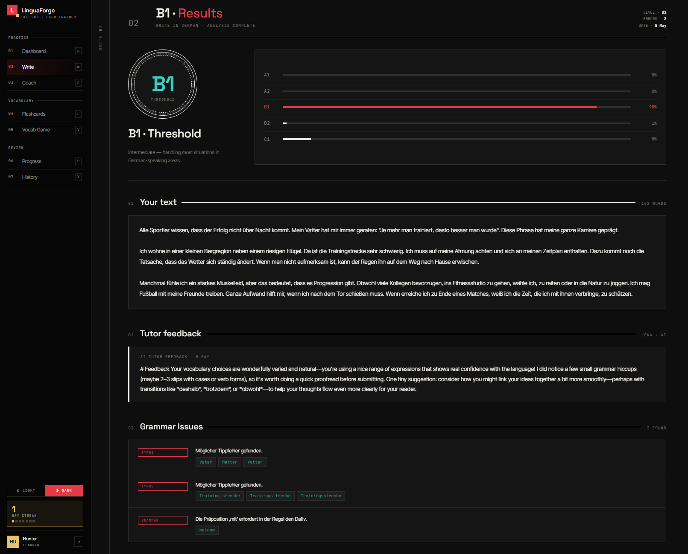
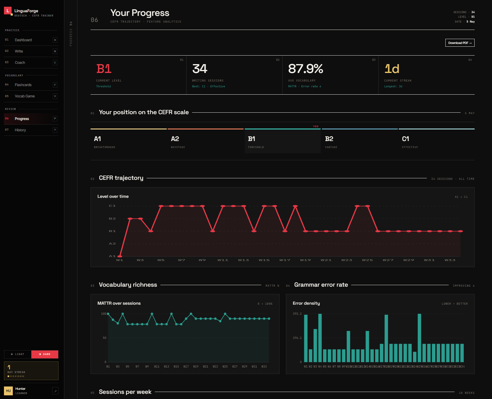
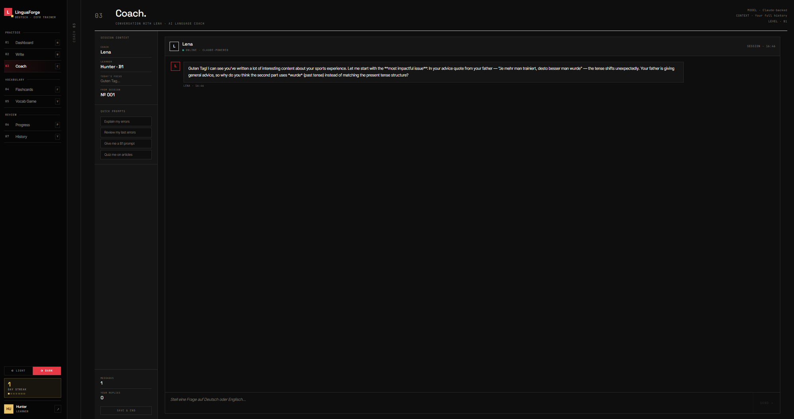
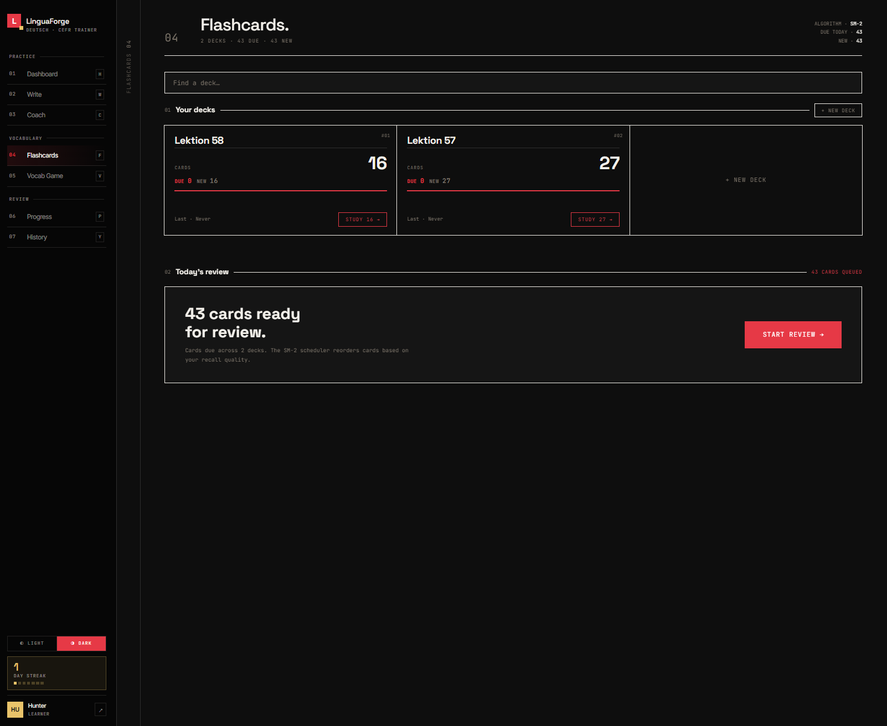
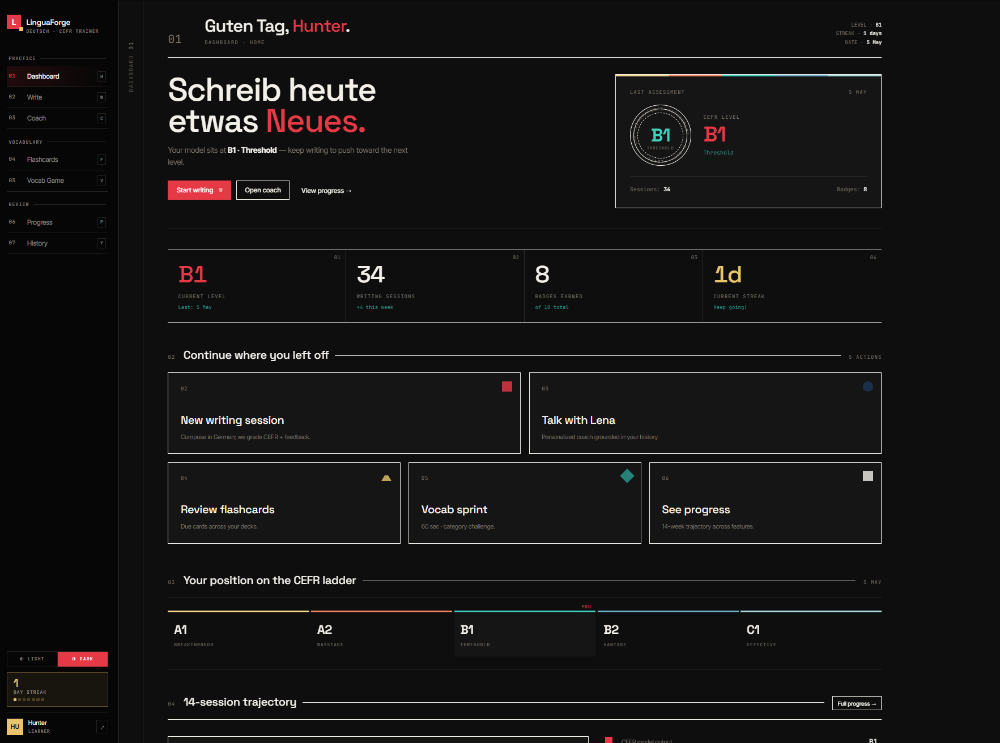
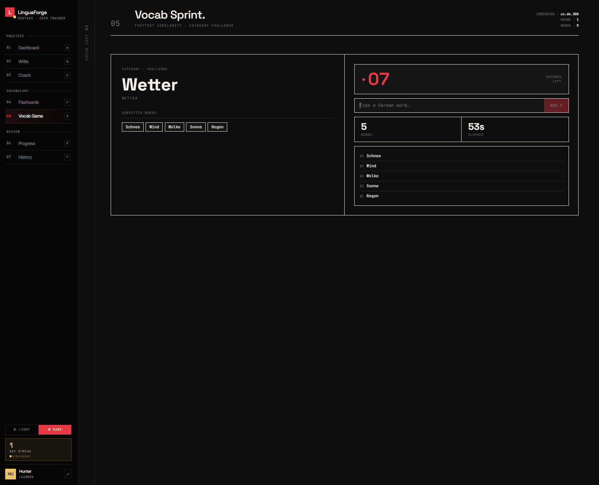
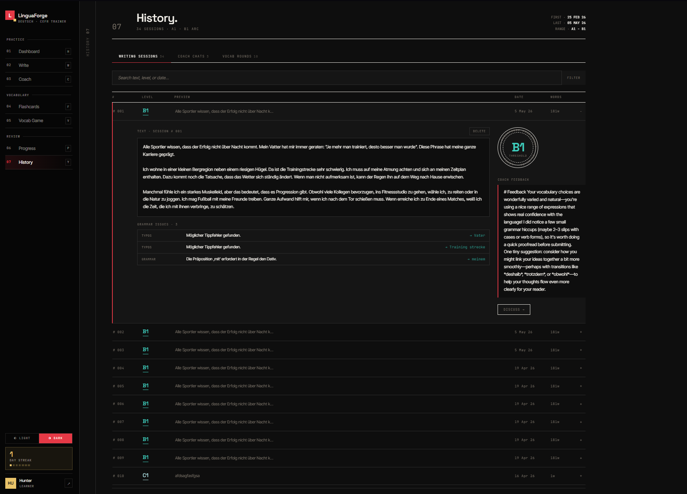
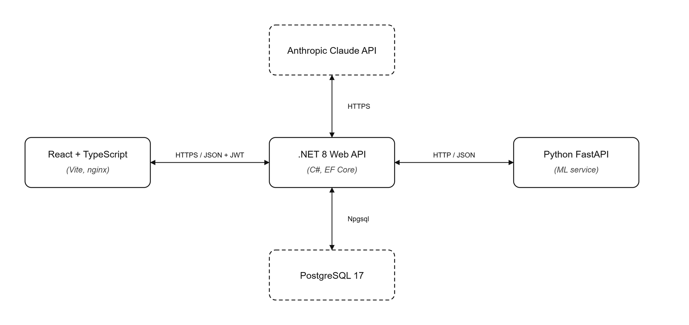
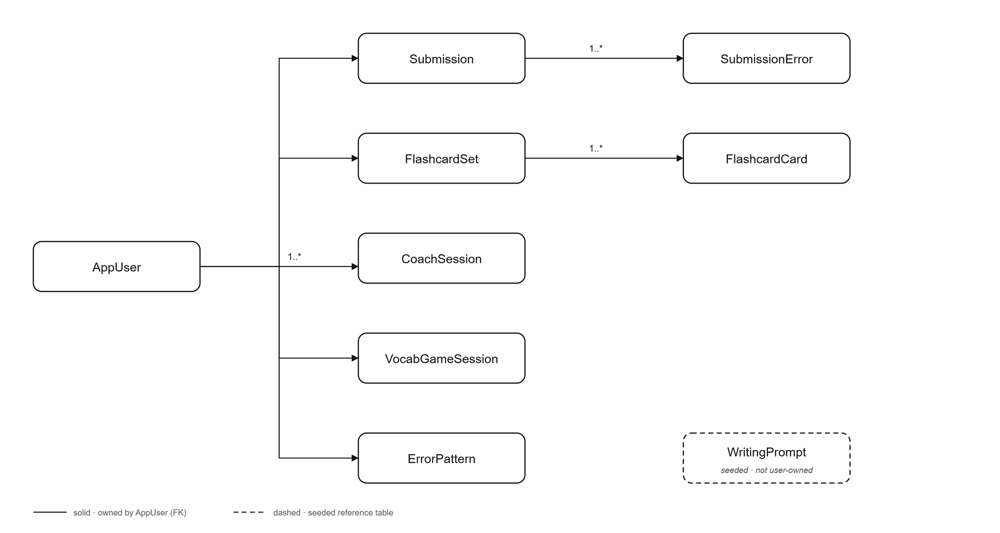

# LinguaForge

A full-stack web application for practising written German with instant, CEFR-graded feedback. A learner writes a short German text; a custom-trained classifier predicts the CEFR level (A1–C1) with per-level confidence, grammar and spelling errors are annotated inline, and an AI tutor explains what to improve. Flashcards, progress analytics, a vocabulary game, and a Socratic coaching chat complete the practice loop.

Developed as a bachelor's thesis project at Babeș-Bolyai University, Faculty of Mathematics and Computer Science.



## Features

- **Writing practice** — submit a German text (typed or dictated via Whisper speech-to-text) and receive a CEFR level prediction with confidence scores, inline grammar/spelling annotations, a linguistic feature breakdown, GermanBERT vocabulary-upgrade suggestions, and a short written commentary from an AI tutor.
- **Coach** — a multi-turn chat with *Lena*, a Claude-backed German teacher persona that takes a Socratic stance: it asks guiding questions instead of handing out corrections, seeded with the learner's latest submission.
- **Flashcards** — learner-curated decks with CSV import, plus cards auto-generated from spelling mistakes, reviewed on an SM-2 spaced-repetition schedule with flip and typing study modes.
- **Progress tracking** — CEFR trajectory, vocabulary richness (MATTR), grammar error density, writing frequency, and achievement badges across all sessions.
- **Vocab Sprint** — a timed game: type as many German words in a given category as possible; answers are validated against fastText embeddings.
- **History** — every submission, coach session, and game round is persisted and browsable.

| | | |
|---|---|---|
|  |  |  |
|  |  |  |

## The CEFR classifier

The core of the project is a compact, interpretable classifier trained on the German subset of the [MERLIN learner corpus](https://merlin-platform.eu/) (1,033 exam texts, levels A1–C1). Each text is mapped to a 22-dimensional feature vector grounded in the Complexity–Accuracy–Fluency framework from second language acquisition research:

- **Fluency**: token/sentence counts, average sentence and word length, short-text flag
- **Lexical complexity**: MATTR (window 50), lexical density, median Zipf frequency, repetition ratio
- **Syntactic complexity**: dependency depth, subordinate-clause and conjunction ratios, verb ratio
- **Accuracy**: grammar, orthographic, and total error rates (LanguageTool)
- **Coherence**: sentence-embedding similarity statistics (SentenceTransformers)
- **Interaction features**: three hand-crafted composites targeting known failure modes

A scikit-learn MLP (128–64–32) on top of these features reaches **0.744 accuracy / 0.746 macro-F1** under five-fold nested cross-validation — competitive with classical feature-based systems that use hundreds to thousands of features, while running comfortably on CPU.

Training code lives in `python-api/` (`feature_extractor.py`, `train_cefr_classifier.py`, `run_pipeline.py`).

## Architecture



Three services plus a database, orchestrated with Docker Compose:

| Service | Port | Stack | Role |
|---|---|---|---|
| `frontend` | 3000 | React 18 + TypeScript + Vite, served by nginx | SPA |
| `backend` | 5000 | .NET 8 (ASP.NET Core), EF Core, PostgreSQL, JWT auth | business logic, orchestration, Claude API calls |
| `python-api` | 8001 | Python 3.11 + FastAPI, spaCy, LanguageTool, scikit-learn | feature extraction, CEFR prediction, transcription, vocab game |
| `db` | 5432 | PostgreSQL 17 | persistence |

The backend follows a clean-architecture layering across five projects (`Backend`, `Controller`, `Service`, `Repository`, `Domain`); the frontend uses feature folders (`write/`, `coach/`, `flashcards/`, `progress/`, …) with per-feature API hooks. The database schema is managed code-first with EF Core migrations, applied automatically on startup.



## Getting started

Prerequisites: Docker and Docker Compose. Create a `.env` file in the repository root:

```env
JWT_SECRET=<at least 32 characters>
ANTHROPIC_API_KEY=<your key>   # optional; AI feedback/coach degrade gracefully without it
```

Then:

```bash
docker-compose up -d
```

The Python service pre-warms spaCy, LanguageTool, and the sentence-embedding model on boot, so its cold start takes ~90–120 seconds; the backend waits for its health check before starting. The app is then available at `http://localhost:3000`.

### fastText model (Vocab Sprint)

The Vocab Sprint game validates answers against fastText word embeddings, which require the German model `cc.de.300.bin` (~7 GB). It is not included in this repository. Download `cc.de.300.bin` from the [fastText word vectors page](https://fasttext.cc/docs/en/crawl-vectors.html), decompress it, and place it at `python-api/models/cc.de.300.bin`. Everything else runs without it — only the Vocab Sprint endpoints are affected.

### Development mode

```bash
# Backend (https://localhost:7100)
dotnet run --project Backend/Backend

# Frontend (Vite dev server on :5173, proxies to the backend)
cd Frontend && npm install && npm run dev

# ML service
cd python-api && pip install -r requirements.txt
uvicorn main:app --host 0.0.0.0 --port 8001
```

### Configuration

| Variable | Where | Purpose |
|---|---|---|
| `JWT_SECRET`, `ANTHROPIC_API_KEY` | `/.env` | injected by docker-compose |
| `VITE_API_URL` | `Frontend/.env` | backend URL (default `http://localhost:5000`) |
| `VOCAB_DETECTION_ENABLED` | python-api env | toggle GermanBERT vocabulary suggestions |
| `BERT_CONFIDENCE_THRESHOLD` | python-api env | suggestion confidence cutoff |
| `WHISPER_MODEL` | python-api env | Whisper model size for transcription |

## Testing

The backend service layer is covered by an xUnit suite (mocked repositories and HTTP handlers, no database required):

```bash
dotnet test Backend
```

## Acknowledgements

- The [MERLIN corpus](https://merlin-platform.eu/) (Boyd et al., 2014), used under its academic research licence — the trained model is not for commercial redistribution.
- spaCy, LanguageTool, SentenceTransformers, wordfreq, scikit-learn, fastText, and OpenAI Whisper for the NLP stack.
- Anthropic's Claude models power the tutor feedback and coaching chat.
